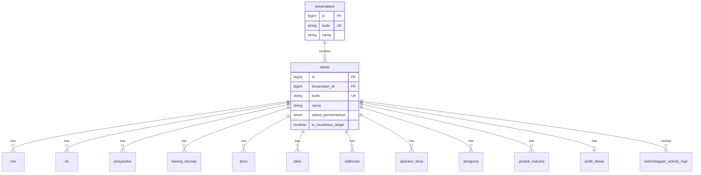

# Database Schema Diagram - DPMD

## Overview
Diagram struktur database DPMD dengan 32+ tables dan relasi antar entitas.

---

## 1. Core User & Auth Module


---

## 2. Kelembagaan Module (Main Entities)



---

## 3. RW & RT Structure


---

## 4. Kelembagaan Entities (Posyandu, LPM, PKK, etc)


---

## 5. Pengurus (Polymorphic Relation)


**Note**: `pengurusable_type` dapat berisi:
- `rws`
- `rts`
- `posyandus`
- `karang_tarunas`
- `lpms`
- `pkks`
- `satlinmas`

---

## 6. Produk Hukum Module


---

## 7. Aparatur Desa Module


---

## 8. BUMDes Module


---

## 9. Surat Masuk & Disposisi Module


---

## 10. Jadwal Kegiatan Module


---

## 11. Activity Logs Module


---

## 12. App Settings & Other Modules

```mermaid
erDiagram
    users ||--o{ app_settings : updates
    users ||--o{ push_subscriptions : subscribes
    
    app_settings {
        int id PK
        string setting_key UK
        text setting_value
        string description
        bigint updated_by_user_id FK
    }
    
    push_subscriptions {
        bigint id PK
        bigint user_id FK
        text endpoint
        json subscription
    }
    
    profil_desas {
        bigint id PK
        bigint desa_id FK UK
        string klasifikasi_desa
        string status_desa
        int jumlah_penduduk
        text sejarah_desa
        string no_telp
        string email
        decimal latitude
        decimal longitude
    }
```

---

## 13. Legacy/Support Tables


---

## Database Statistics

- **Total Models**: 32+
- **Main Modules**:
  - User Management & Auth
  - Kelembagaan (8 entity types: RW, RT, Posyandu, Karang Taruna, LPM, PKK, Satlinmas, Pengurus)
  - Aparatur Desa
  - BUMDes
  - Produk Hukum (Legal Documents)
  - Surat Masuk & Disposisi
  - Jadwal Kegiatan (Activity Scheduling)
  - Activity Logs (2 types: general & kelembagaan-specific)
  - Push Notifications
  - App Settings

## Key Features

1. **Polymorphic Relations**: 
   - `pengurus` dapat terhubung ke berbagai kelembagaan via `pengurusable_type` & `pengurusable_id`

2. **Soft Foreign Keys**:
   - Produk Hukum dapat di-link ke berbagai entitas (Aparatur, BUMDes, Kelembagaan)

3. **Activity Tracking**:
   - 2 level: `kelembagaan_activity_logs` (specific) & `activity_logs` (general)

4. **Multi-level Disposisi**:
   - Surat dapat didisposisikan bertingkat dengan `level_disposisi`

5. **Status Tracking**:
   - Hampir semua entitas kelembagaan memiliki:
     - `status_kelembagaan` (aktif/nonaktif)
     - `status_verifikasi` (verified/unverified)

---

## Enum Types Summary

### User Roles
- superadmin, kepala_dinas, sekretaris_dinas, kepala_bidang, ketua_tim, pegawai, desa, kecamatan

### Status Types
- Kelembagaan: aktif, nonaktif
- Verifikasi: verified, unverified
- Surat: draft, dikirim, selesai
- Disposisi: pending, dibaca, proses, selesai, teruskan
- Jadwal: draft, pending, approved, rejected, completed, cancelled

### Produk Hukum
- Jenis: Peraturan Desa, Peraturan Kepala Desa, Keputusan Kepala Desa
- Singkatan: PERDES, PERKADES, SK KADES
- Status: berlaku, dicabut

---

## Indexes & Performance

**Key Indexes**:
- Foreign keys: semua relasi memiliki index
- Status fields: untuk filtering
- Timestamps: untuk sorting & filtering
- Composite indexes: untuk query kompleks (e.g., `surat_status_tanggal`)

---

**Generated**: December 31, 2025  
**Database**: MySQL  
**ORM**: Prisma  
**Project**: DPMD Bogor - Sistem Informasi Pemberdayaan Masyarakat Desa
